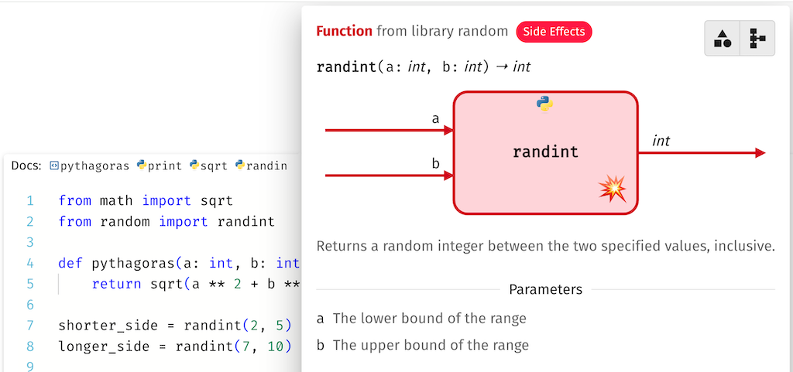

# Judicious

**Judicious** is a pedagogical documentation system for Python.
It offers a clear and distinctive visual representation of functions and constants;
gradually presents more information such as types, optional and variable-length parameters for functions;
highlights functions with side effects;
and instantaneously generates documentation also for functions defined in student code.

### 💻 Playground

Try Judicious in your browser at [judicious.vercel.app](https://judicious.vercel.app).

### 📃 Design Principles

This [SPLASH-E paper](https://www.chiodini.org/publications/splashe24-judicious.pdf) provides more information on Judicious' design principles.

### ⚙️ Development

Judicious is an open-source project built using [Next.js](https://nextjs.org/). To run it locally, clone the repository, install the dependencies with `npm install`, and start the development server with `npm run dev`.

React components are in the `components` directory. The Python analyzer inside the `tools/python-analyzer` directory is a Rust program compiled to WebAssembly using [wasm-pack](https://rustwasm.github.io/wasm-pack/). JSON files with the documentation of Python standard libraries are in `public/docs`.